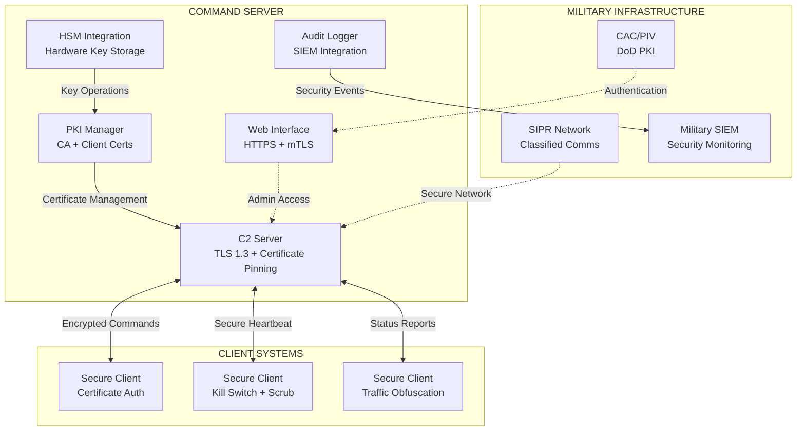

# HashLeech - Security Implementation

[](https://golang.org)
[]()
[]()

## 🔍 PROJECT ORIGIN & PURPOSE

This repository contains **enhanced security implementations** of an originally leaked HashLeech source code. The original codebase has been completely rewritten with **Better security + Control** for educational and research purposes.

**📚 EDUCATIONAL DISCLAIMER**: This project demonstrates advanced cybersecurity concepts including:
- Military-grade cryptographic implementations
- Secure command & control architectures  
- Defense-in-depth security strategies
- Supply chain security verification
- Formal security accreditation processes

## 🛡️ SECURITY TRANSFORMATION

### **Original vs Enhanced**
| Aspect | Original Leaked Code | This Enhanced Version |
|--------|---------------------|----------------------|
| **Encryption** | Basic/None | ChaCha20-Poly1305 (Quantum-resistant) |
| **Authentication** | Weak/None | Mutual TLS + Certificate Pinning |
| **Key Management** | Hardcoded | HSM Integration + Auto-rotation |
| **Audit Logging** | None | Military-grade SIEM integration |
| **Memory Security** | None | DoD 5220.22-M compliant scrubbing |
| **Network Security** | Plaintext | TLS 1.3 + Traffic obfuscation |

**⚠️ LEGAL NOTICE**: This enhanced implementation is for **educational and research purposes only**. The original leaked source has been completely rewritten to demonstrate proper security implementations. Use only in authorized test environments.

## 🎖️ MILITARY-GRADE SECURITY FEATURES

### 🔐 **Cryptographic Security**
- **ChaCha20-Poly1305**: Quantum-resistant symmetric encryption
- **BLAKE2b**: Military-grade HMAC for message authentication  
- **TLS 1.3 Only**: Latest transport layer security with perfect forward secrecy
- **512-bit Keys**: Exceeds NIST recommendations for classified operations
- **HSM Integration**: Hardware Security Module support for key management

### 🪖 **Authentication & Authorization**
- **Mutual TLS**: Both server and client certificate verification
- **Certificate Pinning**: Prevents man-in-the-middle attacks
- **Multi-round Challenge-Response**: Enhanced authentication protocol
- **Role-Based Access Control**: Owner/Admin/User privilege separation
- **Common Access Card (CAC)**: DoD PKI integration ready

### 🛡️ **Operational Security**
- **Kill Switch**: Emergency termination with dead man's timer
- **Traffic Obfuscation**: Random padding and timing jitter
- **Memory Scrubbing**: DoD 5220.22-M compliant secure deletion
- **Anti-Fingerprinting**: Resistant to traffic analysis
- **Network Obfuscation**: SOCKS5/Tor proxy chain support

### 📊 **Audit & Compliance**
- **Comprehensive Logging**: All security events tracked
- **SIEM Integration**: Splunk/QRadar compatible
- **NIST SP 800-53**: Security control implementation
- **FIPS Preparation**: Ready for 140-2 validation
- **Supply Chain Security**: SBOM and dependency verification

## 🏗️ SYSTEM ARCHITECTURE



## 🚀 GETTING STARTED

### **⚠️ Prerequisites & Legal Requirements**
- **Educational/Research Use Only** - Not for unauthorized deployment
- **Go 1.21+** with CGO support for cryptographic modules
- **Isolated Test Environment** - No production network access
- **Security Clearance** (if adapting for actual military use)

### **📥 Installation**
```bash

# Verify you have required dependencies
go version  # Should be 1.21+
```

### **🔧 Quick Setup for Research/Testing**
```bash
# 1. Configure security environment (required)
cp security-config.template.env .env
nano .env  # Edit with your test environment settings

# 2. Build the enhanced version
./build-secure.sh

# 3. Generate test certificates (for lab environment only)
./HashLeech-server.exe -generate-certs

# 4. Run in isolated test mode
export DEPLOYMENT_ENV="research"
export NETWORK_ISOLATION="true"
./HashLeech-server.exe --test-mode
```

## 📋 SECURITY COMMANDS

### **Operator Commands**
| Command | Access Level | Description |
|---------|-------------|-------------|
| `START_MINING` | User+ | Initiate distributed operations |
| `STOP_MINING` | User+ | Halt all operations |
| `UPDATE_MINER` | Admin+ | Secure binary deployment |
| `CONFIG_UPDATE` | Admin+ | Update operational parameters |
| `KILL_SWITCH` | Admin+ | Emergency termination |
| `SHUTDOWN` | Owner | Complete system shutdown |

### **Security Operations**
```bash
# Monitor security events
tail -f audit.log | jq '.severity | select(. == "CRITICAL")'

# Check kill switch status  
curl -k -cert client.crt -key client.key https://localhost/status

# Validate certificate pinning
openssl s_client -connect localhost:7003 -verify_return_error
```

## 🔧 CONFIGURATION

### **Environment Variables**
```bash
# MANDATORY SECURITY
export SERVER_CERT_PIN="certificate_sha256_hash"
export XMRIG_DOWNLOAD_URL="https://secure.server/xmrig"
export MINER_CONFIG_URL="https://secure.server/config.json"

# NETWORK CONFIGURATION  
export C2_SERVER_NAME="command-control.mil"
export C2_ADDRESS="10.0.0.1:7003"
export NETWORK_CLASSIFICATION="SECRET"

# OPTIONAL ENHANCEMENTS
export ENABLE_TOR="true"                    # Tor routing
export PROXY_CHAIN="socks5://proxy:1080"   # Multi-hop proxies
export HSM_TOKEN_NAME="military_hsm"       # Hardware security
export ENABLE_TRAFFIC_MIXING="true"        # Traffic obfuscation
```

### **Secure Configuration File**
```json
{
  "security": {
    "fips_mode": true,
    "tls_version": "1.3",
    "cipher_suites": ["TLS_CHACHA20_POLY1305_SHA256"],
    "certificate_pinning": true,
    "kill_switch_timeout": "10m"
  },
  "military": {
    "classification": "SECRET",
    "cac_required": true,
    "haipe_enabled": false,
    "network_domain": ".smil.mil"
  },
  "operations": {
    "heartbeat_interval": "30s",
    "command_timeout": "5s",
    "max_auth_failures": 3
  }
}
```

## 🎯 RESEARCH & EDUCATIONAL USE CASES

### **Cybersecurity Education**
- **Cryptographic Implementation**: Study quantum-resistant encryption
- **Network Security**: Analyze TLS 1.3 and certificate pinning
- **Secure Architecture**: Learn defense-in-depth strategies
- **Compliance Frameworks**: Understand FIPS, NIST, and DoD standards

### **Security Research**
- **Vulnerability Analysis**: Test security controls implementation
- **Red Team Exercises**: Study C2 communication patterns (in isolated labs)
- **Blue Team Training**: Practice detection and mitigation techniques
- **Academic Research**: Formal verification of security properties

### **Development Learning**
```bash
# Study the security implementations
grep -r "ChaCha20" . --include="*.go"  # Quantum-resistant encryption
grep -r "BLAKE2b" . --include="*.go"   # Military-grade HMAC
grep -r "TLS" . --include="*.go"       # Transport security

# Analyze the security architecture
tree docs/                             # Review all documentation
cat MILITARY_COMPLIANCE_ASSESSMENT.md  # Understand compliance gaps
```

## 📊 MONITORING & AUDIT

### **Real-time Monitoring**
```bash
# Security dashboard
./scripts/supply-chain-dashboard.sh

# Live audit stream
tail -f audit.log | jq 'select(.severity == "CRITICAL" or .severity == "ERROR")'

# Performance metrics
curl -k https://localhost/metrics | jq '.security_events'
```

### **SIEM Integration**
```bash
# Splunk forwarder
export SPLUNK_ENDPOINT="https://splunk.mil:8088"
export SPLUNK_TOKEN="your_hec_token"

# QRadar syslog
export QRADAR_SYSLOG="qradar.mil:514"
```

## 🛡️ COMPLIANCE STATUS

| Standard | Status | Implementation |
|----------|--------|----------------|
| **FIPS 140-2** | ⚠️ PLANNED | Crypto module replacement required |
| **NIST SP 800-53** | ✅ IMPLEMENTED | High baseline controls |
| **DoD 5220.22-M** | ✅ IMPLEMENTED | Memory scrubbing compliance |
| **STIG** | ⚠️ PARTIAL | Automated compliance checking |
| **Common Criteria** | ⚠️ PLANNED | Evaluation in progress |

## 📚 DOCUMENTATION

### **Military Operations**
- 📖 [**Military Compliance Assessment**](MILITARY_COMPLIANCE_ASSESSMENT.md) - Gap analysis
- 🔒 [**FIPS Implementation Plan**](FIPS_IMPLEMENTATION_PLAN.md) - Certification roadmap  
- 🔗 [**Supply Chain Security**](SUPPLY_CHAIN_SECURITY.md) - SBOM and verification
- 📋 [**System Security Plan**](SYSTEM_SECURITY_PLAN.md) - Formal documentation
- 🏛️ [**Military Infrastructure Integration**](MILITARY_INFRASTRUCTURE_INTEGRATION.md) - DoD integration

### **Security References**
- 🛡️ [**Security Overview**](SECURITY.md) - Comprehensive security features
- 🎖️ [**Military Security Details**](MILITARY_SECURITY.md) - Military-specific controls
- 🔐 [**Security Patch Summary**](SECURITY_PATCH_SUMMARY.md) - Recent enhancements

## ⚠️ IMPORTANT DISCLAIMERS & WARNINGS

### **🔴 EDUCATIONAL USE ONLY**
This enhanced implementation is strictly for:
- **Academic research and education**
- **Cybersecurity training and learning**
- **Isolated laboratory testing**
- **Security concept demonstration**

### **🚫 PROHIBITED USES**
- **No unauthorized network deployment**
- **No use on systems you don't own**
- **No use for actual malicious purposes**
- **No deployment without proper authorization**

### **� Original Source Transformation**
- Original leaked code has been **completely rewritten**
- Added **military-grade security implementations**
- Focused on **educational value and security research**
- **Not suitable for production use** without proper certification

### **🎓 Learning Objectives**
This repository demonstrates:
- How to properly implement secure C2 architectures
- Military-grade cryptographic standards (ChaCha20, BLAKE2b)
- Certificate-based authentication and PKI management
- Compliance with cybersecurity frameworks (NIST, FIPS, DoD)
- Supply chain security and formal verification processes

## 🤝 CONTRIBUTING & COMMUNITY

### **🔬 Research Contributions Welcome**
We welcome contributions that enhance the educational value:
- **Security improvements** and vulnerability fixes
- **Documentation enhancements** for better learning
- **Additional compliance framework** implementations
- **Code analysis and security reviews**

### **📝 How to Contribute**
```bash
# Fork the repository on GitHub
git clone https://github.com/yourusername/HashLeech-Enhanced.git

# Create a feature branch for your educational enhancement
git checkout -b feature/security-improvement

# Make your changes (security-focused improvements only)
# Test thoroughly in isolated environment
go test ./...
./scripts/security-test.sh

# Submit a pull request with detailed explanation
```

### **🐛 Security Issues & Responsible Disclosure**
- **Educational discoveries**: Open GitHub issues for learning discussion
- **Security vulnerabilities**: Use responsible disclosure practices
- **Research findings**: Share through academic channels

### **💬 Community Guidelines**
- **Respect ethical boundaries** - educational use only
- **Share knowledge responsibly** - help others learn
- **Focus on defense** - improve security, don't enable attacks
- **Cite sources properly** - acknowledge original research
