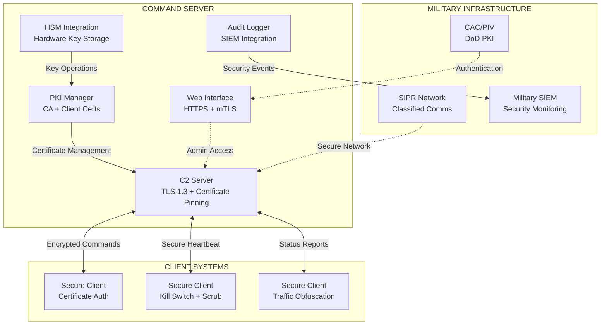

# HashLeech Command & Control Framework For Mining

**Classification**: UNCLASSIFIED//FOR OFFICIAL USE ONLY  
**Purpose**: Secure Command & Control System for Military Operations  
**Security Level**: MILITARY-GRADE ENCRYPTION & AUTHENTICATION

## 🛡️ OVERVIEW

HashLeech is a military-grade command and control (C2) framework designed for secure distributed operations. It implements comprehensive security controls including mutual TLS authentication, quantum-resistant cryptography, and DoD-compliant audit logging.

**⚠️ DISCLAIMER**: This system requires proper authorization and security clearance for military deployment. Current implementation is for development and testing only until formal FIPS 140-2 certification is obtained.

## 🎖️ MILITARY-GRADE SECURITY FEATURES

### 🔐 **Cryptographic Security**
- **ChaCha20-Poly1305**: Quantum-resistant symmetric encryption
- **BLAKE2b**: Military-grade HMAC for message authentication  
- **TLS 1.3 Only**: Latest transport layer security with perfect forward secrecy
- **512-bit Keys**: Exceeds NIST recommendations for classified operations
- **HSM Integration**: Hardware Security Module support for key management

### 🪖 **Authentication & Authorization**
- **Mutual TLS**: Both server and client certificate verification
- **Certificate Pinning**: Prevents man-in-the-middle attacks
- **Multi-round Challenge-Response**: Enhanced authentication protocol
- **Role-Based Access Control**: Owner/Admin/User privilege separation
- **Common Access Card (CAC)**: DoD PKI integration ready

### 🛡️ **Operational Security**
- **Kill Switch**: Emergency termination with dead man's timer
- **Traffic Obfuscation**: Random padding and timing jitter
- **Memory Scrubbing**: DoD 5220.22-M compliant secure deletion
- **Anti-Fingerprinting**: Resistant to traffic analysis
- **Network Obfuscation**: SOCKS5/Tor proxy chain support

### 📊 **Audit & Compliance**
- **Comprehensive Logging**: All security events tracked
- **SIEM Integration**: Splunk/QRadar compatible
- **NIST SP 800-53**: Security control implementation
- **FIPS Preparation**: Ready for 140-2 validation
- **Supply Chain Security**: SBOM and dependency verification

## 🏗️ SYSTEM ARCHITECTURE



## 🚀 QUICK START

### Prerequisites
- **Go 1.21+** with CGO support
- **OpenSSL/BoringSSL** for FIPS crypto (production)
- **Hardware Security Module** (recommended)
- **Military PKI Certificates** (for production deployment)

### 1. **Security Configuration**
```bash
# Copy security template
cp security-config.template.env production.env

# Configure mandatory security variables
export SERVER_CERT_PIN="sha256_hash_of_your_certificate"
export XMRIG_DOWNLOAD_URL="https://secure.internal.server/xmrig.zip" 
export MINER_CONFIG_URL="https://secure.internal.server/config.json"
export C2_SERVER_NAME="secure-command.local"
export C2_ADDRESS="10.0.0.1:7003"
```

### 2. **Build & Deploy**
```bash
# Military-grade build
./build-secure.sh

# Deploy with security validation
./deploy-military.bat    # Windows
./deploy-military.sh     # Linux
```

### 3. **Generate PKI Certificates**
```bash
# Generate CA, server, and client certificates
./HashLeech-server.exe -generate-certs

# Verify certificate chain
openssl verify -CAfile ca.crt server.crt client.crt
```

## 📋 SECURITY COMMANDS

### **Operator Commands**
| Command | Access Level | Description |
|---------|-------------|-------------|
| `START_MINING` | User+ | Initiate distributed operations |
| `STOP_MINING` | User+ | Halt all operations |
| `UPDATE_MINER` | Admin+ | Secure binary deployment |
| `CONFIG_UPDATE` | Admin+ | Update operational parameters |
| `KILL_SWITCH` | Admin+ | Emergency termination |
| `SHUTDOWN` | Owner | Complete system shutdown |

### **Security Operations**
```bash
# Monitor security events
tail -f audit.log | jq '.severity | select(. == "CRITICAL")'

# Check kill switch status  
curl -k -cert client.crt -key client.key https://localhost/status

# Validate certificate pinning
openssl s_client -connect localhost:7003 -verify_return_error
```

## 🔧 CONFIGURATION

### **Environment Variables**
```bash
# MANDATORY SECURITY
export SERVER_CERT_PIN="certificate_sha256_hash"
export XMRIG_DOWNLOAD_URL="https://secure.server/xmrig"
export MINER_CONFIG_URL="https://secure.server/config.json"

# NETWORK CONFIGURATION  
export C2_SERVER_NAME="command-control.mil"
export C2_ADDRESS="10.0.0.1:7003"
export NETWORK_CLASSIFICATION="SECRET"

# OPTIONAL ENHANCEMENTS
export ENABLE_TOR="true"                    # Tor routing
export PROXY_CHAIN="socks5://proxy:1080"   # Multi-hop proxies
export HSM_TOKEN_NAME="military_hsm"       # Hardware security
export ENABLE_TRAFFIC_MIXING="true"        # Traffic obfuscation
```

### **Secure Configuration File**
```json
{
  "security": {
    "fips_mode": true,
    "tls_version": "1.3",
    "cipher_suites": ["TLS_CHACHA20_POLY1305_SHA256"],
    "certificate_pinning": true,
    "kill_switch_timeout": "10m"
  },
  "military": {
    "classification": "SECRET",
    "cac_required": true,
    "haipe_enabled": false,
    "network_domain": ".smil.mil"
  },
  "operations": {
    "heartbeat_interval": "30s",
    "command_timeout": "5s",
    "max_auth_failures": 3
  }
}
```

## 🎯 OPERATIONAL MODES

### **Development Mode**
```bash
# Basic security for development/testing
export DEPLOYMENT_ENV="development"
export FIPS_MODE="false"  
./HashLeech-server.exe
```

### **Military Production**
```bash
# Full military-grade security
export DEPLOYMENT_ENV="production"
export FIPS_MODE="true"
export NETWORK_CLASSIFICATION="SECRET"
./HashLeech-server.exe --military-mode
```

### **Covert Operations**
```bash
# Maximum stealth configuration
export ENABLE_TOR="true"
export ENABLE_TRAFFIC_MIXING="true"
export FINGERPRINT_JITTER_MAX="15000"
./HashLeech-server.exe --covert-mode
```

## 📊 MONITORING & AUDIT

### **Real-time Monitoring**
```bash
# Security dashboard
./scripts/supply-chain-dashboard.sh

# Live audit stream
tail -f audit.log | jq 'select(.severity == "CRITICAL" or .severity == "ERROR")'

# Performance metrics
curl -k https://localhost/metrics | jq '.security_events'
```

### **SIEM Integration**
```bash
# Splunk forwarder
export SPLUNK_ENDPOINT="https://splunk.mil:8088"
export SPLUNK_TOKEN="your_hec_token"

# QRadar syslog
export QRADAR_SYSLOG="qradar.mil:514"
```

## 🛡️ COMPLIANCE STATUS

| Standard | Status | Implementation |
|----------|--------|----------------|
| **FIPS 140-2** | ⚠️ PLANNED | Crypto module replacement required |
| **NIST SP 800-53** | ✅ IMPLEMENTED | High baseline controls |
| **DoD 5220.22-M** | ✅ IMPLEMENTED | Memory scrubbing compliance |
| **STIG** | ⚠️ PARTIAL | Automated compliance checking |
| **Common Criteria** | ⚠️ PLANNED | Evaluation in progress |

## 📚 DOCUMENTATION

### **Military Operations**
- 📖 [**Military Compliance Assessment**](MILITARY_COMPLIANCE_ASSESSMENT.md) - Gap analysis
- 🔒 [**FIPS Implementation Plan**](FIPS_IMPLEMENTATION_PLAN.md) - Certification roadmap  
- 🔗 [**Supply Chain Security**](SUPPLY_CHAIN_SECURITY.md) - SBOM and verification
- 📋 [**System Security Plan**](SYSTEM_SECURITY_PLAN.md) - Formal documentation
- 🏛️ [**Military Infrastructure Integration**](MILITARY_INFRASTRUCTURE_INTEGRATION.md) - DoD integration

### **Security References**
- 🛡️ [**Security Overview**](SECURITY.md) - Comprehensive security features
- 🎖️ [**Military Security Details**](MILITARY_SECURITY.md) - Military-specific controls
- 🔐 [**Security Patch Summary**](SECURITY_PATCH_SUMMARY.md) - Recent enhancements

## ⚠️ DEPLOYMENT WARNINGS

### **🔴 NOT APPROVED FOR MILITARY USE**
Current system requires formal certification:
- **FIPS 140-2 validation** (6-12 months)
- **Authority to Operate (ATO)** (12-18 months) 
- **Supply chain verification** (1-2 months)
- **DoD PKI integration** (3-6 months)

### **🟡 DEVELOPMENT/TESTING ONLY**
Until formal certification is complete:
- Use only in isolated test environments
- No classified data processing
- No production military networks
- Requires security officer approval

## 🤝 CONTRIBUTION & SUPPORT

### **Security Issues**
Report security vulnerabilities through secure channels:
- **Classified**: [SIPR email]
- **Unclassified**: Create GitHub issue with `[SECURITY]` tag

### **Development Guidelines**
```bash
# Security-first development
go vet ./...
gosec ./...
govulncheck ./...

# Build with security flags
CGO_ENABLED=1 go build -trimpath -ldflags="-s -w"
```

## 📄 LICENSE & CLASSIFICATION

**License**: [Appropriate Military/Government License]  
**Classification**: UNCLASSIFIED//FOR OFFICIAL USE ONLY  
**Distribution**: AUTHORIZED PERSONNEL ONLY  
**Export Control**: Subject to ITAR/EAR restrictions

---

**⚡ HashLeech Military Framework - Secure by Design, Ready for Mission**

*For technical support contact your designated system security officer*
